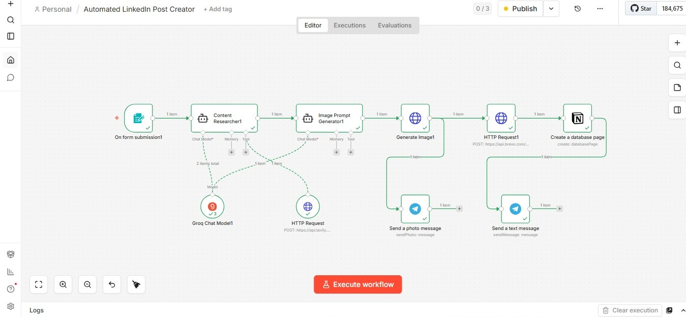

# AI LinkedIn Post Creator

> An agentic n8n workflow that researches any topic in real time, writes a professional LinkedIn post, generates a matching AI image, and delivers everything via Email & Telegram — fully automated, zero manual effort.

**Stack:** n8n · Groq LLaMA 3.3 70B · Tavily · Pollinations · Brevo · Telegram · Notion · Railway
---

## Problem Statement

Creating consistent, high-quality LinkedIn content is time-consuming. Most professionals know they should post regularly but struggle with research, writing, and design — all of which take 30–60 minutes per post.

This workflow reduces that to **under 60 seconds**: submit a topic, get a fully written post + AI-generated image delivered directly to your inbox and phone.

---

## Live Demo

**Form URL:** [Submit a topic → get your post](https://n8n-production-c82e.up.railway.app/form/d0dd325e-5ef1-47e3-b955-77ee75875ef1)

**What happens after you submit:**
- Email arrives with post text + image link
- Telegram delivers AI image + post instantly
- Notion auto-logs the post with timestamp

---

## Workflow Architecture

```
Form Trigger
    ↓
Content Researcher (Groq LLaMA 3.3 70B + Tavily)
    ↓ Real-time web research on your topic
LinkedIn Post Writer (Groq LLaMA 3.3 70B)
    ↓ Writes hook, body, CTA, hashtags
Image Prompt Generator (Groq LLaMA 3.3 70B)
    ↓ Creates a visual prompt based on post content
AI Image Generator (Pollinations AI)
    ↓ Free image — no API key needed
Email Delivery (Brevo HTTP API)
    ↓ Post text + "Click to View Image" button
Notion Logger
    ↓ Auto-logs Title, Content, Image URL, Date
Telegram Delivery
    → AI image + full post text to your phone
```

---

## Tech Stack

| Layer | Tool | Purpose |
|---|---|---|
| Workflow Engine | n8n (self-hosted) | Visual automation orchestration |
| AI / LLM | Groq API — LLaMA 3.3 70B | Content research, writing, image prompting |
| Web Research | Tavily API | Real-time topic research |
| Image Generation | Pollinations AI | Free AI image generation |
| Email Delivery | Brevo HTTP API | Transactional email |
| Mobile Delivery | Telegram Bot API | Instant image + text delivery |
| Database | Notion API | Auto-logging all generated posts |
| Hosting | Railway (free tier) | 24/7 deployment |

**Total infrastructure cost: $0/month** — all free tiers.

---

## Output Preview

| Channel | What You Receive |
|---|---|
| Email | Post text + blue "Click to View Image" button |
| Telegram | AI-generated image + full post text |
| Notion | Auto-logged entry with date, content, image URL |

---

## How to Run This Yourself

### Prerequisites
- n8n instance (local or cloud)
- Free accounts on: Groq, Tavily, Brevo, Telegram, Notion, Pollinations (no signup needed)

### Step-by-Step Setup

**1. Import the workflow**
- Download `workflow.json` from this repo
- In n8n → click **"Import from file"** → upload the JSON

**2. Add your credentials in n8n**
```
Groq API Key       → console.groq.com (free)
Tavily API Key     → tavily.com (free)
Brevo API Key      → brevo.com (free)
Telegram Bot Token → create via @BotFather
Telegram Chat ID   → get via @userinfobot
Notion Token       → notion.so/my-integrations
```

**3. Set up Notion Database**
Create a database with these fields:
- `Title` (text)
- `Content` (text)
- `Image URL` (url)
- `Date` (date)

**4. Activate and test**
- Toggle workflow to **Active**
- Open the Form URL
- Submit any LinkedIn topic
- Check your email + Telegram within ~30 seconds

---

## Project Structure

```
ai-linkedin-post-creator/
│
├── workflow.json          # Full n8n workflow (import this)
├── README.md              # This file
└── assets/
    └── workflow-screenshot.png   # Visual of the node flow
```

---

## Key Technical Decisions

**Why Groq over OpenAI?**
Groq's free tier offers LLaMA 3.3 70B with extremely fast inference — zero cost and production-grade quality.

**Why Brevo over SMTP/Gmail?**
Gmail OAuth requires Google Cloud Console setup and has strict sending limits. Brevo HTTP API works without OAuth — simpler, more reliable, free up to 300 emails/day.

**Why Pollinations over DALL·E?**
DALL·E costs money per image. Pollinations generates images via a free HTTP URL — no API key, no billing, no limits.

---

## Future Improvements

- [ ] Add LinkedIn direct posting via LinkedIn API
- [ ] Schedule posts for optimal engagement times
- [ ] Add tone selector (professional / casual / storytelling)
- [ ] Multi-language post generation
- [ ] Analytics dashboard in Notion (views, engagement tracking)

---

## About

Built by **Utkarsh Kapoor** — MBA candidate at ABV-IIITM Gwalior, transitioning from Operations Management into AI Engineering.

This project is part of an AI & automation portfolio demonstrating agentic workflow design, multi-tool orchestration, and production deployment on free infrastructure.

[LinkedIn](https://linkedin.com/in/utkarsh-kapoor-618256203) · [GitHub](https://github.com/utkarshkapoor95) · [n8n Template](https://creators.n8n.io/workflows/15156)

---

## License

MIT License — free to use, modify, and share.
